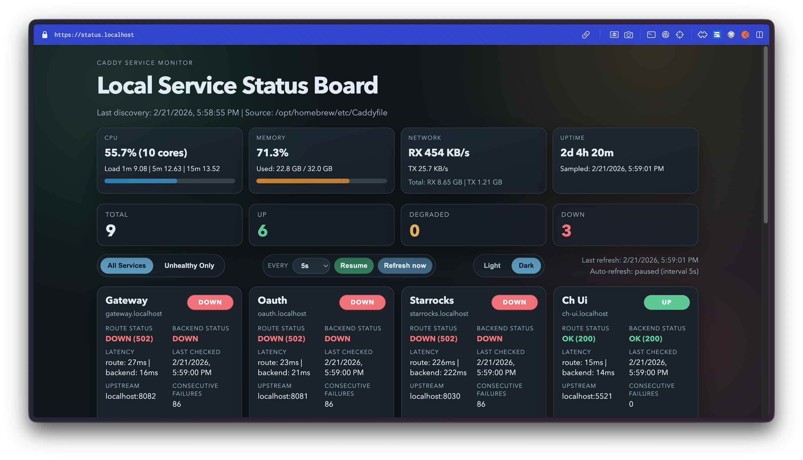

# Caddy Service Status Dashboard

Status-first local dashboard for services declared in a Caddyfile.

## Product Preview



## Problem

When you run many local services behind Caddy, failures are hard to reason about quickly:

- Is Caddy route resolution broken, or is the service itself down?
- Are databases healthy even when HTTP route checks fail?
- Which services are failing right now, without checking many tabs/logs?

Most local setups end up with ad-hoc scripts or manual checks, which are slow and inconsistent.

## Why this project exists

This project gives a single, status-first control page for local development environments where Caddy fronts multiple services.

It separates two health dimensions so troubleshooting is faster:

- **Route status**: Caddy hostname path is reachable via HTTP(S)
- **Backend status**: Upstream service is reachable directly (HTTP or TCP)

For TCP services (for example MySQL/Redis), route checks are marked **N/A** and overall health is backend-driven.

## Why this is useful

- Reduces time-to-diagnosis when local stacks partially fail
- Prevents false negatives for database-like services
- Makes service state visible to teammates using a shared local convention
- Works with minimal dependencies and a small footprint

## Features

- Auto-discovery of `reverse_proxy` routes via `caddy adapt`
- Per-service dual status model (route + backend)
- TCP-aware semantics for DB/cache services
- Host metrics panel (CPU, memory, network throughput, uptime)
- Theme toggle (light/dark) with persisted preference
- Status summary cards and per-service detail cards
- Refresh controls (Grafana-style): interval select, pause/resume, refresh-now
- In-memory rolling history
- API endpoints:
  - `GET /api/v1/services`
  - `GET /api/v1/status`
  - `GET /api/v1/status/:serviceId`

## Quick start

### Prerequisites

- Node.js 22+
- Caddy installed and available (default path expected: `/opt/homebrew/opt/caddy/bin/caddy`)

### Run

```bash
npm run start
```

### Test

```bash
npm test
```

## Configuration

Default runtime values:

- Dashboard bind: `127.0.0.1:9079`
- Caddy source: `/opt/homebrew/etc/Caddyfile`
- Overrides file: `config/services.overrides.yaml`
- Probe interval: `5000ms`
- Discovery interval: `30000ms`
- Probe timeout: `2000ms`

Override via environment variables:

- `DASHBOARD_HOST`
- `DASHBOARD_PORT`
- `CADDY_BIN`
- `CADDYFILE_PATH`
- `OVERRIDES_PATH`
- `DISCOVERY_INTERVAL_MS`
- `PROBE_INTERVAL_MS`
- `PROBE_TIMEOUT_MS`
- `HISTORY_LIMIT`

## Host metrics notes

- The memory card reports **host memory usage**, not just one app/process.
- On macOS, memory used is derived from `vm_stat` as:
  - `active + wired + compressed` pages
- This is closer to Activity Monitor's "Memory Used" semantics than a raw `total - free` calculation.
- Network throughput is sampled from cumulative host counters, so rates are request-interval based.

## Caddy integration

Add this site block to your Caddyfile:

```caddy
status.localhost {
    reverse_proxy localhost:9079
    tls internal
}
```

Then reload Caddy.

## Service overrides

Edit `config/services.overrides.yaml`:

```yaml
services:
  portal.localhost:
    displayName: Portal UI
    backendKind: http
    healthPath: /health
    expectedStatusCodes: [200]

  redis.localhost:
    backendKind: tcp
```

## Open source and public GitHub readiness

This repository includes:

- `.github/workflows/ci.yml`
- `.gitignore`
